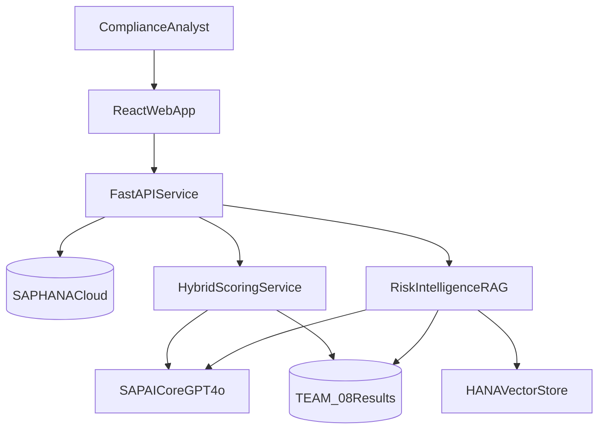

# RiskAssess — Project Specification

## 1. Purpose

RiskAssess is an AI-assisted alert triage and risk-intelligence application for TrustSphere Bank. It prioritises alerted transactions with an auditable 0–100 score and gives investigators a grounded, plain-language explanation of the underlying risk drivers.

The first release addresses the bank's 12,000 annual alerts, 90–95% false-positive rate, 1–3 day review cycle, and three-day payment delay. It supports investigators; it never files a SAR, blocks a payment, or closes an alert autonomously.

## 2. Outcomes and success measures

- Rank all active alerts by regulatory and financial-crime exposure.
- Reduce time spent assembling alert context by at least 50%.
- Target a 30% reduction in cost per case within 18 months.
- Preserve human accountability for every disposition and escalation.
- Return every score with factor-level evidence, model metadata, and an audit trail.
- Keep customer data in approved SAP BTP/HANA regional environments.

## 3. Scope

### In scope

- Alert queue with search, filtering, sorting, pagination, and risk-tier summaries.
- Five-factor AI-assisted score with deterministic aggregation.
- Alert details, factor rationales, evidence, company and transaction context.
- RAG-grounded risk-intelligence narrative generated through SAP AI Core.
- Cached results, model/version metadata, fallback behaviour, and health checks.

### Out of scope

- Autonomous payment/account blocking, SAR filing, or customer exit decisions.
- Employee productivity monitoring.
- Replacement of source transaction-monitoring rules.
- Production model approval; the prototype demonstrates controls required for later validation.

## 4. Users

- Financial crime investigator: reviews ranked alerts and evidence.
- Team lead: monitors queue distribution and ageing.
- Model risk validator: reproduces inputs, prompts, outputs, and formula.
- Platform administrator: configures SAP HANA and SAP AI Core connections.

## 5. Risk scoring

### 5.1 Formula

GPT-4o evaluates five bounded factors. Python validates and adds the returned points:

```text
FinalScore =
  EntityRisk (0–25)
  + TransactionBehaviour (0–25)
  + GeographicRisk (0–20)
  + BehaviouralDeviation (0–15)
  + RegulatorySensitivity (0–15)
```

- Low: 0–33
- Medium: 34–66
- High: 67–100

| Factor | Maximum | Primary HANA context | Assessment |
| --- | ---: | --- | --- |
| Entity risk profile | 25 | `COMPANY_RISK_PROFILES`, `COMPANY_BENEFICIAL_OWNER`, `SANCTIONS_LISTS` | Sanctions, PEP, adverse media, ownership opacity |
| Transaction behaviour | 25 | `TRANSACTIONS` | Amount, structuring, speed, round-number and rapid-transfer patterns |
| Geographic risk | 20 | `COUNTRIES` | FATF status and origin/destination country risk |
| Behavioural deviation | 15 | `TRANSACTIONS`, `TRANSACTION_BASELINES` | Difference from normal amount, frequency, and corridors |
| Regulatory sensitivity | 15 | `COUNTRIES`, `COMPLIANCE_CASES` | Supervisory intensity and prior compliance cases |

### 5.2 Model output contract

The model must return JSON only. Every factor contains `score`, `max_score`, `rationale`, and `evidence`. The backend rejects non-numeric, negative, over-limit, incomplete, or mismatched values. It calculates the total itself; a model-supplied total is never trusted.

### 5.3 Reliability controls

- Temperature 0 for repeatability.
- Versioned system prompt and rubric.
- Bounded Pydantic response validation and one repair retry.
- Cache by alert ID, source-data fingerprint, prompt version, and model name.
- Explicit `ai`, `fallback`, or `cached` provenance on every score.
- Deterministic fallback scoring when AI Core is unavailable.
- No autonomous adverse customer action.

## 6. Risk intelligence

The explanation service retrieves alert, transaction, entity, country, case, and factor evidence from HANA. Optional policy/rule passages are retrieved from HANA Cloud vector storage. GPT-4o then produces:

- concise executive summary;
- key risk drivers with source values;
- mitigating observations;
- suggested investigator checks;
- data limitations and a human-review disclaimer.

The prompt instructs the model not to invent facts, infer protected traits, claim guilt, or recommend an automatic SAR/payment decision. Explanations are cached with model, prompt, source, and retrieval metadata.

## 7. Architecture



### Technology stack

- Frontend: React, TypeScript, Vite, Tailwind CSS, Recharts, TanStack Query.
- Backend: Python 3.11+, FastAPI, Pydantic, hdbcli, httpx.
- SAP: SAP HANA Cloud for source data/results/vector retrieval; SAP AI Core for GPT-4o and embeddings when deployed.
- Local operations: Docker Compose and environment variables.

The backend includes a demo-data adapter so the UI remains reliable when competition credentials expire. Demo mode is visibly identified and never silently presented as live HANA data.

## 8. API

| Method | Route | Purpose |
| --- | --- | --- |
| `GET` | `/api/health` | Service, HANA, AI Core and data-mode health |
| `GET` | `/api/alerts` | Paginated, filtered, sorted alert queue |
| `GET` | `/api/alerts/stats` | Counts by tier and aggregate queue metrics |
| `GET` | `/api/alerts/{id}` | Alert, parties, transaction and factor detail |
| `POST` | `/api/alerts/{id}/score` | Generate or refresh bounded hybrid score |
| `GET` | `/api/alerts/{id}/score` | Retrieve score and provenance |
| `POST` | `/api/alerts/{id}/explain` | Generate or refresh grounded narrative |
| `GET` | `/api/alerts/{id}/explanation` | Retrieve cached narrative |
| `GET` | `/api/companies/{id}` | Company and transaction summary |
| `GET` | `/api/transactions/{id}` | Transaction and party details |

Errors use a consistent `{ "detail": "...", "code": "..." }` shape. Collection endpoints accept `page`, `page_size`, `tier`, `status`, `search`, `sort_by`, and `sort_order`.

## 9. Data and persistence

Source data is read from `TRUSTSPHERE_REFERENCE`. Writable application data belongs in `TEAM_08`.

Recommended result tables:

- `RISK_SCORES`: alert ID, source fingerprint, five scores/rationales/evidence, total, tier, model, prompt version, provenance, timestamps.
- `RISK_EXPLANATIONS`: alert ID, narrative sections, citations, model, prompt version, retrieval metadata, timestamp.
- `RISK_KNOWLEDGE`: document ID, title, content, metadata, embedding (`REAL_VECTOR` where available).

All SQL identifiers come from an allow-list. Values are parameterised. Credentials are loaded from environment variables and never returned by APIs or logs.

## 10. UI specification

### Visual language

- Primary: red `#DC2626`; hover: `#B91C1C`; subtle accent: `#FEF2F2`.
- Background and cards: white `#FFFFFF`, with neutral borders and restrained shadows.
- Main text: `#111827`; secondary text: `#6B7280`.
- Tier semantics: high red, medium amber, low emerald.
- Red is reserved for primary actions, active navigation, and urgent risk signals.

### Screens

1. Dashboard: KPI cards, risk-distribution chart, queue search/filters, and ranked alert table.
2. Alert details: score gauge, five-factor chart/cards, transaction and entity context, evidence, model provenance, and intelligence narrative.
3. Responsive behaviour: desktop-first table; stacked cards on narrow screens.

Accessibility requirements include semantic HTML, keyboard focus, labelled controls, colour-independent tier text, sufficient contrast, and reduced-motion support.

## 11. Security, governance, and resilience

- Store secrets only in uncommitted environment files or a BTP secret service.
- Validate TLS certificates in production; disabling validation is a local diagnostic option only.
- Apply least-privilege HANA users and regional data residency.
- Redact unnecessary personal data before prompts and avoid logging prompt payloads.
- Record prompt/model versions, inputs fingerprint, outputs, reviewer identity, and disposition.
- Use request timeouts, retry with jitter, circuit breaking, bounded concurrency, and cached responses.
- Provide health endpoints and visible degraded/demo mode.
- Treat all model output as decision support requiring human review.

## 12. Testing and acceptance

- Unit: score bounds, tier boundaries, aggregation, output validation, fallback scoring, prompt construction.
- Integration: repository adapters, API filtering/pagination/errors, mocked AI Core responses.
- Frontend: loading, empty, error, degraded, dashboard, and detail states.
- Security: no credentials in responses/logs; SQL values parameterised.
- Acceptance: one command starts the stack; dashboard loads; alerts rank correctly; each detail page shows five factors and a grounded explanation; the app still demonstrates with demo data if external services are unavailable.

## 13. Delivery sequence

1. Discover live HANA schema and AI Core deployments.
2. Build typed backend, adapters, health checks, and demo fallback.
3. Implement hybrid scoring and structured GPT-4o integration.
4. Implement alert/company/transaction APIs.
5. Build dashboard and alert detail UI.
6. Add risk-intelligence retrieval, generation, and caching.
7. Test degraded paths, document setup, and rehearse the seven-minute demo.

## 14. Assumptions and known risks

- Competition credentials and model deployments may be time-limited.
- Planned table names may differ from the actual reference schema; the repository layer maps discovered columns and degrades safely.
- GPT-4o scoring influences prioritisation and therefore requires formal model validation before production.
- RAG improves grounding but does not guarantee factuality; citations and human review remain mandatory.
- Business KPI improvements are targets to validate during a controlled pilot, not guaranteed outcomes.
