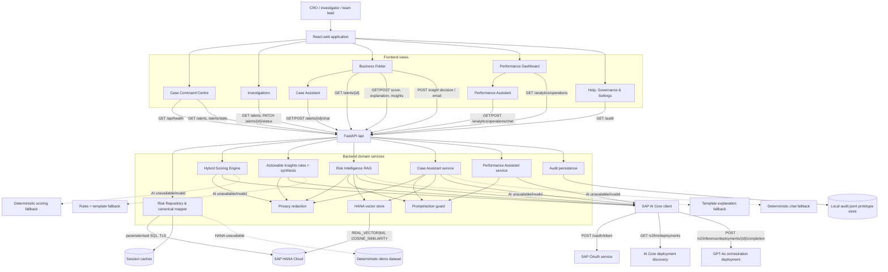
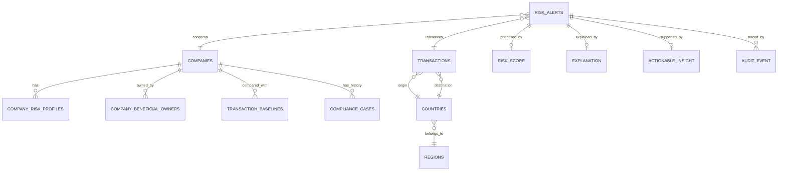

# RiskAssess: Business and Technical Documentation

> **Document status:** Current prototype documentation  
> **Application:** RiskAssess for TrustSphere Bank  
> **Executive owner and narrative perspective:** Group Chief Risk Officer, TrustSphere Bank  
> **Purpose:** Set out our financial-crime problem, the capabilities we are adopting, the architecture and SAP integrations that support them, the controls I require as Group CRO, the outcomes we expect, and the gaps we must close before production.  
> **Evidence convention:** “Case fact” means a value supplied in the SCALE 2026 case. “Implemented” means it exists in the current codebase. “Target” or “illustrative” means it must be validated in a controlled pilot and is not a guaranteed outcome.

---

## 1. Executive summary

We process 118,400 high-value cross-border transactions per year, but our financial-crime controls still depend on static rules, manual review, and fragmented regional data. Our transaction-monitoring process produces 12,000 alerts annually, 90–95% of which are false positives. Escalated reviews take one to three days, high-value payments are delayed by three business days, and our financial-crime operating costs have risen 25% in two years. We are also under heightened regulatory scrutiny and a hiring freeze. We cannot add people indefinitely or compromise explainability, regulatory standing, or human accountability.

RiskAssess is the human-in-the-loop triage and investigation-support capability we are adopting to:

- unifies alert, transaction, company, country, beneficial-owner, baseline, and compliance-case context from SAP HANA Cloud;
- assigns every alert a transparent 0–100 priority score across five bounded risk factors;
- ranks the work queue by risk, regulatory exposure, and SLA pressure;
- uses GPT-4o through SAP AI Core to produce grounded explanations, case assistance, and plain-language drafts;
- retrieves relevant policy passages through a vector index in SAP HANA Cloud;
- provides deterministic rules and fallbacks when AI or HANA is unavailable;
- redacts personal data before LLM calls and applies prompt-injection controls;
- preserves human approval, override, and accountability for every material decision; and
- exposes operational analytics for backlog, review time, closure, false-positive outcomes, SLA adherence, and unresolved exposure.

As Group CRO, I require RiskAssess to remain a **decision-support and workflow-prioritisation layer**, not an autonomous decision maker. It must not autonomously block payments, file suspicious activity reports (SARs), close accounts, or determine criminality. Accountability for customer-impacting decisions remains with our authorised people.

---

## 2. Business context

### 2.1 Our institution

TrustSphere Bank is our multinational financial institution, serving approximately 2,400 corporate and institutional relationships across North America, Europe, and Asia. We provide high-value cross-border payments, trade finance, and financial-risk management.

| Case fact | Value |
|---|---:|
| FY2025 high-value cross-border transactions | 118,400 |
| FY2023 high-value cross-border transactions | 100,200 |
| FY2025 group revenue | USD 1.9 billion |
| Employees | Approximately 6,100 |
| Financial-crime operations analysts | 210 |
| Corporate and institutional relationships | Approximately 2,400 |
| Operating footprint | North America, Europe, and Asia |
| Compliance Operations Centre | Singapore |

Our Board requires demonstrable improvement in financial-crime effectiveness and efficiency within 12–18 months without compromising our regulatory standing. Our existing remediation programme has a Q3 2027 deadline and USD 3.2 million of committed spend.

### 2.2 The problem we must solve

Our current financial-crime operating model is not sustainable or scalable:

1. **Static detection does not match evolving crime patterns.** Thresholds and fixed rules are weak at identifying multi-layered ownership, rapid movement of funds, unusual corridors, behavioural deviation, and combinations of risk signals.
2. **Most alerts do not represent productive investigative work.** A 90–95% false-positive rate means investigators spend most of their capacity gathering context for cases that are ultimately cleared.
3. **Data is fragmented by region and function.** Investigators must reconstruct the same case across disconnected systems, creating delays and inconsistent risk visibility.
4. **The queue is not prioritised by regulatory exposure.** A simple first-in-first-out or static-severity queue does not adequately surface aged, high-risk, sanctions-related, or regulatorily sensitive cases.
5. **Manual work increases cost and customer friction.** Reviews take one to three days and high-value payments are delayed by three business days, contributing to client dissatisfaction and exits.
6. **Regulation constrains the solution.** AI must be explainable and formally validated where it influences customer outcomes. Human accountability for SAR and payment-blocking decisions is mandatory.
7. **We cannot hire our way out.** A hiring freeze and attrition make additional headcount an unsustainable answer.
8. **Legacy infrastructure limits real-time assumptions.** The European core platform is more than 15 years old, so a viable solution must tolerate delayed, incomplete, and differently shaped data.

### 2.3 Our current pain points and quantified baseline

| Pain point | Case baseline | Business consequence |
|---|---:|---|
| Manual review time per escalated case | 1–3 days | Slow resolution and growing aged-alert backlog |
| AML alert false-positive rate | 90–95% | Investigator capacity consumed by low-value review |
| Annual alert volume | 12,000 | Approximately 1,000 alerts per month |
| Annual high-value transactions | 118,400 | Large and growing monitoring surface |
| High-value payment approval delay | 3 business days | Customer friction, delayed settlement, possible churn |
| Corporate client exits | 14 in FY2025, up from 9 in FY2024 | 55.6% year-on-year increase |
| Compliance and financial-crime operating-cost growth | +25% over FY2023–FY2025 | Unsustainable cost trajectory |
| Model validation queue | 4–6 months | Material constraint inside the 18-month programme |
| Model Risk Management capacity | 3 FTE | Limited ability to validate multiple complex models |
| Target cost-per-case improvement | 30% reduction in 18 months | COO-sponsored outcome |

### 2.4 My risk mandate and our stakeholder needs

- **My mandate as Group CRO:** require explainable prioritisation, reproducible evidence, preserved human accountability, and realistic allowance for model validation. I remain accountable for ensuring that RiskAssess strengthens—not weakens—our control environment.
- **Our Chief Operating Officer:** needs 30% lower cost per case, reduced backlog, faster payment decisions, and no dependency on additional headcount.
- **Our Chief Technology Officer:** needs an architecture that works with legacy and fragmented systems and can scale beyond a pilot without becoming a permanent exception.
- **Our investigators:** need one place to view the alert, transaction, entity, ownership, behavioural baseline, policy, precedents, and recommended checks.
- **Our model validators:** need bounded outputs, versioned prompts, source fingerprints, deterministic aggregation, confidence indicators, and audit records.
- **Our regulators and auditors:** require traceable evidence, regional data controls, human decisions, clear limitations, and no autonomous adverse action.
- **Our corporate clients:** should experience fewer unnecessary delays and receive clearer requests when additional information is genuinely required.

---

## 3. Solution scope and prioritisation

### 3.1 What we are solving first

We are using RiskAssess to address **alert triage, investigation-context assembly, explainability, and operational prioritisation** first. I have prioritised this intervention because it:

- directly targets manual effort and aged-alert exposure;
- can sit above our existing monitoring rules without replacing our source systems;
- creates value even when data arrives in batches rather than real time;
- preserves the lighter governance path for rule-based workflow improvements;
- can be piloted regionally inside the 12–18 month horizon; and
- provides the evidence and auditability needed before expanding AI's influence.

### 3.2 Explicitly out of scope

- autonomous payment or account blocking;
- autonomous SAR filing;
- autonomous alert closure or customer exit;
- declarations of guilt or criminality;
- replacement of source transaction-monitoring rules;
- employee productivity monitoring;
- production model approval;
- a clean, real-time replacement for every regional source platform; and
- unrestricted generative-AI access to raw customer personal data.

This boundary is important to our governance position: RiskAssess improves **which case we review next and how quickly our investigators understand it**. We do not claim that the prototype itself eliminates false alerts at source.

---

## 4. How RiskAssess addresses our pain points

| Our pain point | RiskAssess response | Intended outcome |
|---|---|---|
| Fragmented data | Canonical repository layer joins HANA alert, transaction, company, ownership, country, baseline, and case data | Less manual context assembly |
| Unprioritised backlog | 0–100 score, high/medium/low tiers, SLA-breach-first sorting, urgency score, and unresolved-exposure KPIs | Highest regulatory exposure reviewed first |
| Static, opaque rules | Five-factor score with factor-level rationale, evidence, confidence, prompt/model metadata, and deterministic total | Explainable and reproducible triage |
| Very high false-positive workload | Low-risk cases are surfaced with supporting evidence while high-risk cases receive priority | Faster safe handling of likely false positives without weakening scrutiny |
| Slow investigation | Business Folder, policy retrieval, precedents, case assistant, charts, draft notes, and actionable recommendations | Shorter time to understand and document a case |
| Rising cost under hiring freeze | Automation of retrieval, synthesis, ranking, and drafting | Lower effort and cost per case |
| Regulatory scrutiny | Human approval/override, audit events, no autonomous adverse action, and visible model provenance | Defensible governance |
| Legacy and unreliable integrations | Normalisation, capped working set, caching, demo/degraded mode, deterministic scoring, and template fallbacks | Continued operation during partial outages |
| Data-residency and privacy constraints | Singapore-region policy, HANA/BTP-aligned architecture, prompt minimisation, and deterministic pseudonyms | Reduced external exposure of personal data |
| Prompt injection and unsafe requests | Input sanitisation, untrusted-content delimiters, blocked action patterns, grounded prompts, schema validation, and UI-only dispositions | Lower risk of model manipulation |

---

## 5. Current application features

### 5.1 Case Command Centre

- KPI cards for alert population and queue status.
- High, medium, and low priority distribution.
- Search across alert, company, transaction, and alert type.
- Filterable and sortable alert table.
- Pagination and risk-tier/status filtering.
- SLA-breached high-tier cases surfaced first in default score ordering.
- Visible live-HANA, demo, cached, AI, or fallback provenance.
- Normalised status with preservation of the original source status.

### 5.2 Investigations view

- Read-only investigations-focused queue.
- Shared search, filters, sorting, and Business Folder navigation.
- Status labels that do not rely on colour alone.
- Session-scoped status update API for prototype workflow demonstrations.

### 5.3 Business Folder / alert detail

- 0–100 risk gauge and priority tier.
- Five-factor risk breakdown.
- Factor rationale, evidence, confidence, source, model, prompt version, and generation time.
- Transaction amount, currency, corridor, time, channel, purpose, and counterparty.
- Company industry, jurisdiction, KYC risk, PEP/sanctions indicators, prior cases, and baseline.
- Beneficial-owner names, ownership percentages, PEP/sanctions flags, nationality, and residence when available.
- 12-month transaction activity chart from HANA, or clearly identified synthetic demo history.
- Current amount-to-baseline comparison.
- Grounded explanation with drivers, mitigating factors, checks, limitations, and citations.
- Accessible glossary/annex for specialist terms.

### 5.4 Hybrid risk scoring

The application scores five bounded factors:

```text
Final risk score =
    Entity risk profile          (0–25)
  + Transaction behaviour       (0–25)
  + Geographic risk             (0–20)
  + Behavioural deviation       (0–15)
  + Regulatory sensitivity      (0–15)
                              = 0–100
```

| Factor | Maximum | Evidence considered |
|---|---:|---|
| Entity risk profile | 25 | Sanctions, PEP association, adverse media, ownership complexity, KYC profile |
| Transaction behaviour | 25 | Amount, structuring, velocity, rapid transfers, payment pattern |
| Geographic risk | 20 | Destination risk, FATF context, high-risk region, new corridor |
| Behavioural deviation | 15 | Amount and activity relative to entity baseline |
| Regulatory sensitivity | 15 | Supervisory attention and prior compliance cases |

Tier boundaries are deterministic:

- **Low:** 0–33
- **Medium:** 34–66
- **High:** 67–100

GPT-4o may propose factor scores and explanations, but Python validates every factor bound and calculates the final total. The model is never trusted to supply the final score.

### 5.5 Actionable Insights

- Transparent rule-based recommended path: clear, escalate to Tier 2, request KYC, or draft SAR.
- Rule IDs and matched inputs displayed as a reasoning trace.
- A separate 0–100 urgency/exposure score based on case age, tier, regulatory sensitivity, sanctions exposure, and amount.
- Evidence pack and precedent summaries.
- AI-assisted rationale and draft notes, with a deterministic template fallback.
- Low-confidence abstention: weak evidence redirects strong clear/SAR recommendations toward requesting more information.
- Human **Approve**, **Override**, or **Request further information** decision.
- Decision record with actor, reason code, free text, edits, timestamp, previous state, and resulting state.
- C-suite/client email drafting; drafts are not sent automatically.

### 5.6 Case Assistant

- Alert-scoped chat grounded only in the current case, score, evidence, policy passages, precedents, and prior chat history.
- Suggested questions based on the strongest factor and available data.
- Factor-breakdown, activity-versus-baseline, and precedent-outcome charts.
- Case-note and email drafting.
- Citations attached to answers.
- Refusal of requests to clear, escalate, file a SAR, block a payment, or otherwise execute a disposition.

### 5.7 Performance Dashboard and Assistant

- Six- and twelve-month operational views.
- Alerts raised and closed by month.
- Current backlog, open cases, and investigating cases.
- Median review time when audit events support the calculation.
- Closure rate, SLA adherence, false-positive outcome rate, and review-timeout rate.
- High-priority unresolved count and associated monetary exposure.
- Total unresolved exposure and latest-month backlog change.
- Performance assistant grounded in the selected dashboard period.
- Generated charts for raised versus closed, SLA breaches, transaction value, and closed cases.
- Forecast refusal: the assistant describes observed data but does not invent future projections.
- Demo analytics are explicitly labelled illustrative rather than live bank performance.

### 5.8 Help, governance, and settings

- Governance and human-accountability guidance in the product.
- Light/dark theme stored locally in the browser.
- Service-health visibility for data mode, SAP HANA, SAP AI Core, and configured model.

---

## 6. Technical architecture

### 6.1 Technology stack

| Layer | Technology |
|---|---|
| Frontend | React 19, TypeScript, Vite, TanStack Query, Recharts, Lucide, Tailwind tooling |
| Backend | Python, FastAPI, Pydantic, Uvicorn |
| SAP data platform | SAP HANA Cloud via `hdbcli` |
| SAP AI platform | SAP AI Core Orchestration using GPT-4o |
| Retrieval | SAP HANA `REAL_VECTOR(64)` and cosine similarity; deterministic local fallback |
| HTTP integration | Browser Fetch API and Python `httpx` |
| Local runtime | Docker Compose; Nginx-served frontend and backend service |
| Test stack | Pytest, FastAPI TestClient, TypeScript compiler, Vite production build |

### 6.2 Deployment context

Our current repository supports:

1. local frontend and backend development;
2. a two-container Docker Compose deployment; and
3. connection to remote SAP HANA Cloud and SAP AI Core services.

We have approved SAP BTP in Singapore as a regional environment for this use case. The code and privacy metadata are designed for that target, but the repository does **not** by itself prove that the current local Docker deployment is running on SAP BTP. Before I approve production use, we must complete deployment, identity, network, secret-management, and residency controls and retain evidence that they operate as designed.

### 6.3 Full system and application-flow graph



### 6.4 End-to-end alert flow

```mermaid
sequenceDiagram
    actor Analyst
    participant UI as React UI
    participant API as FastAPI
    participant Repo as Repository
    participant HANA as SAP HANA Cloud
    participant Score as Scoring Engine
    participant Guard as Privacy/Prompt Guard
    participant AIC as SAP AI Core
    participant Vector as HANA Vector Store

    Analyst->>UI: Open command centre
    UI->>API: GET /api/alerts?filters&sort
    API->>Repo: Load canonical alert contexts
    Repo->>HANA: Join alerts, transactions, companies, countries, profiles, baselines, owners, cases
    alt HANA available
        HANA-->>Repo: Source rows
        Repo-->>API: Normalised contexts (max 250)
    else HANA unavailable or query fails
        Repo-->>API: Explicit demo-mode contexts
    end
    API->>Score: Score each working-set alert without external AI refresh
    Score-->>API: Cached or deterministic score
    API-->>UI: Ranked, paginated queue

    Analyst->>UI: Open Business Folder
    UI->>API: GET /api/alerts/{id}
    API->>Repo: Load alert, owners, and activity
    API-->>UI: Detail, evidence, score, provenance

    Analyst->>UI: Refresh score
    UI->>API: POST /api/alerts/{id}/score
    Score->>Guard: Minimise and pseudonymise prompt data
    Score->>AIC: Bounded five-factor JSON request
    AIC-->>Score: Structured factor response
    Score->>Score: Pydantic validation, bound checks, confidence, deterministic sum
    Score-->>UI: Score + factors + metadata

    Analyst->>UI: Generate risk explanation
    UI->>API: POST /api/alerts/{id}/explain
    API->>Vector: Retrieve top policy passages
    Vector->>HANA: Cosine similarity search
    API->>Guard: Redact PII; delimit retrieved content as untrusted
    API->>AIC: Grounded structured explanation request
    AIC-->>API: Summary, drivers, mitigations, checks, limitations
    API-->>UI: Explanation + citations + provenance

    Analyst->>UI: Generate actionable insight
    UI->>API: POST /api/alerts/{id}/insights
    API->>API: Lock recommendation and urgency with transparent rules
    API->>AIC: Synthesis only; recommendation cannot be changed
    API-->>UI: Recommendation, trace, evidence, draft notes

    Analyst->>UI: Approve / override / request information
    UI->>API: POST /api/alerts/{id}/insights/decision
    API->>Repo: Record human decision and edits
    Repo-->>UI: Auditable resulting state
```

---

## 7. API catalogue

All routes below are prefixed with `/api`.

| Method | Route | Purpose | Main downstream dependency |
|---|---|---|---|
| `GET` | `/health` | HANA, AI Core, model, data mode, and degraded-state health | HANA ping, AI Core OAuth |
| `GET` | `/alerts` | Filtered, sorted, paginated priority queue | Repository, scoring |
| `GET` | `/alerts/stats` | Tier and workflow counts | Repository, scoring |
| `GET` | `/alerts/{id}` | Full alert Business Folder | HANA/demo repository |
| `PATCH` | `/alerts/{id}/status` | Prototype session-scoped status change | In-memory context |
| `GET` | `/alerts/{id}/score` | Return cached or deterministic score | Scoring cache/fallback |
| `POST` | `/alerts/{id}/score` | Refresh score through AI Core with fallback | SAP AI Core |
| `GET` | `/alerts/{id}/explanation` | Return cached or newly generated explanation | HANA vector retrieval, AI Core |
| `POST` | `/alerts/{id}/explain` | Force explanation refresh | HANA vector retrieval, AI Core |
| `GET` | `/alerts/{id}/insights` | Return existing actionable insight | Insight cache |
| `POST` | `/alerts/{id}/insights` | Generate governed recommendation and drafts | Rules, AI Core |
| `POST` | `/alerts/{id}/insights/decision` | Record human approval, override, or request for information | Audit persistence |
| `POST` | `/alerts/{id}/insights/email` | Generate/update a C-suite email draft | Rules/template |
| `GET` | `/alerts/{id}/chat` | Load case-assistant thread and suggestions | Repository |
| `POST` | `/alerts/{id}/chat` | Grounded case question, chart, note, or email request | Guard, vector store, AI Core |
| `GET` | `/analytics/operations` | Six/twelve-month operations KPIs and series | HANA aggregates/demo analytics |
| `GET` | `/analytics/operations/chat` | Load performance-assistant thread | Repository |
| `POST` | `/analytics/operations/chat` | Grounded KPI answer or chart | Guard, AI Core |
| `GET` | `/audit` | Retrieve recent audit events, optionally by alert | JSONL + in-memory audit |
| `GET` | `/companies/{id}` | Company profile | Repository |
| `GET` | `/transactions/{id}` | Transaction and party detail | Repository |

Frontend API calls use a configurable `VITE_API_URL`, defaulting to `/api`. Errors are surfaced from the backend's `detail` field.

---

## 8. SAP services and integration

### 8.1 SAP HANA Cloud

**Implemented uses:**

- source alert and transaction data;
- company, industry, country, region, and risk-profile context;
- beneficial-owner attributes;
- transaction baselines;
- compliance-case history;
- monthly operational aggregation;
- audit-log-derived review duration where data is available;
- policy-document storage in a writable `RISK_KNOWLEDGE` table;
- `REAL_VECTOR(64)` embeddings and `COSINE_SIMILARITY` retrieval.

The application reads source data from the configured reference schema, currently modelled as `TRUSTSPHERE_REFERENCE`. Team-owned data is intended for the `TEAM_08` schema.

### 8.2 SAP AI Core

**Implemented uses:**

- OAuth client-credentials authentication;
- automatic discovery of a running AI Core orchestration deployment;
- GPT-4o completion through the deployment `/completion` endpoint;
- structured JSON output with temperature `0`;
- five-factor scoring on explicit refresh;
- grounded explanations;
- recommendation rationale and draft-note synthesis;
- case-assistant and performance-assistant responses.

AI Core is an augmentation layer. Invalid output, timeouts, missing credentials, or service failure cause a deterministic or template fallback rather than a broken workflow.

### 8.3 SAP BTP

SAP BTP is our intended approved hosting and integration environment in the Singapore region. It supports our residency requirement and provides the logical production home for the API, application, identity, secrets, networking, HANA, and AI Core connectivity.

**Current-state caveat:** the repository contains local/Docker deployment assets; it does not contain complete BTP deployment descriptors or proof of a deployed BTP runtime.

### 8.4 Services not currently integrated

- **SAP Joule/Joule Studio:** the product has custom case and performance assistants powered through SAP AI Core, but no current code demonstrates a Joule skill or `.mtar` integration.
- **SAP Datasphere:** not used in the current prototype.
- **SAP Analytics Cloud:** charts are rendered in React/Recharts, not SAP Analytics Cloud.
- **SAP Object Store:** credentials may exist separately, but no current application code uses an object-store client or API.

We retain this distinction so that we do not overstate our SAP footprint during executive, regulatory, or production review.

---

## 9. Data architecture and integration

### 9.1 Canonical data model

The repository facade maps regional/source fields into a stable application object:



### 9.2 Normalisation

The integration layer:

- converts IDs to stable strings for the API;
- maps raw statuses to `open`, `investigating`, or `closed`;
- preserves `raw_status` alongside `normalised_status`;
- distinguishes ordinary closure from timeout/SLA-breach closure;
- defaults missing text to explicit “Unknown” or “Not supplied” labels;
- aggregates owner, baseline, and prior-case facts before scoring;
- converts daily baseline frequency to a monthly figure;
- computes amount-to-baseline ratio only when the denominator is valid;
- converts source facts into bounded booleans, counts, amounts, and risk labels; and
- attaches integration metadata including source, queue cap, and privacy region.

The application does not silently treat absent data as elevated risk. Unknown data affects confidence and may steer the workflow toward additional KYC.

### 9.3 Processing backlog

RiskAssess separates two concepts:

1. **Full operations population:** used for backlog and monthly KPI aggregates.
2. **Scored working set:** a capped subset of the most recent 250 alerts used for interactive triage.

Within the working set, default sorting prioritises:

1. SLA-breached cases;
2. high before medium before low priority; and
3. higher risk score.

Actionable Insights adds an urgency score incorporating hours unresolved, risk tier, regulatory sensitivity, sanctions exposure, and transaction amount. This prevents an average score from hiding a small number of highly consequential aged cases.

For production scale, the current synchronous per-alert queue scoring should be replaced or supplemented with:

- event- or batch-driven precomputation;
- durable job queues and bounded worker concurrency;
- incremental scoring triggered by source-data fingerprints;
- persisted result tables;
- cursor-based pagination and database-side filtering/sorting; and
- explicit dead-letter, retry, and reconciliation workflows.

### 9.4 Caching and change detection

- Alert context is cached by the repository process.
- Score reuse depends on alert ID and a SHA-256 source-data fingerprint.
- Score responses identify `ai`, `fallback`, or `cached` provenance.
- Explanations and insights are cached for the process lifetime.
- SAP AI Core OAuth tokens are cached until near expiry.
- Policy-index creation is protected by a process lock.

### 9.5 Persistence reality

The current prototype is intentionally mixed:

- source HANA data is read from the reference schema;
- policy vectors may be written to HANA;
- scores, explanations, insights, status changes, and chat threads are primarily process memory;
- audit events are also appended to a local `backend/data/audit.jsonl` prototype file; and
- a backend restart can therefore remove non-audit session state.

Production requires durable, transactional persistence in approved regional infrastructure.

---

## 10. Compliance, governance, and model risk

### 10.1 Human accountability

RiskAssess enforces my requirement that our people remain accountable:

- no autonomous payment or account block;
- no autonomous SAR filing;
- no autonomous customer exit;
- no model-controlled alert disposition;
- chat requests for operational actions are refused;
- recommendations are only proposed until a human clicks Approve, Override, or Request further information;
- drafts explicitly require review; and
- decisions record the actor, reason, edits, and timestamp.

### 10.2 Explainability

Every score contains:

- total and tier;
- five factor scores and maximums;
- rationale and evidence per factor;
- confidence and confidence reasons;
- model name;
- prompt version;
- source fingerprint;
- provenance; and
- generation timestamp.

Recommendations include a rule-by-rule reasoning trace. Explanations include key drivers, mitigating factors, recommended checks, limitations, and citations.

### 10.3 Model-risk strategy

The architecture minimises the model's authority:

- factor values are bounded and schema validated;
- the final risk total is calculated in Python;
- deterministic rules lock the recommended action and urgency score;
- the LLM is used primarily for constrained factor assessment and language synthesis;
- low confidence causes abstention from strong clear/SAR recommendations;
- temperature `0` improves repeatability;
- prompts and models are versioned;
- the source fingerprint supports reproducibility;
- invalid AI output falls back safely; and
- fully autonomous adverse action is prohibited.

The GPT-4o scoring path still influences prioritisation and therefore requires formal Model Risk Management validation before production. I will not approve that path for production until validation is complete. We will launch deterministic, rule-based workflow prioritisation first, then enable validated AI-assisted factors within the 4–6 month validation lead time.

### 10.4 Auditability

The prototype records:

- human insight decisions;
- case-assistant turns;
- performance-assistant turns;
- actor;
- citations;
- chart type;
- refused-action flag; and
- timestamps.

For production, audit events should be immutable, centrally retained, access-controlled, and linked to authenticated user identities rather than a hard-coded demonstration persona.

---

## 11. Data privacy and residency

### 11.1 Implemented prompt minimisation

Before payloads are sent to the LLM, the application deep-copies and redacts them:

- company and person names become short deterministic SHA-256-derived tokens;
- counterparties, beneficiaries, owner names, and resolver names are pseudonymised;
- descriptions, purposes, notes, and similar free text are redacted or truncated;
- owner nationality and residence are removed;
- email-like strings in free text are masked;
- the prompt receives privacy-region metadata; and
- the full case remains visible to the authorised user in the application rather than in the model prompt.

### 11.2 Residency posture

Our target region is **AP-Southeast / Singapore BTP**, an approved environment for our customer data. HANA connections use encryption and certificate validation by default.

### 11.3 Privacy limitations and production controls needed

The current prototype does not yet demonstrate:

- end-user authentication or role-based access control;
- field- and row-level authorisation;
- consent/purpose enforcement;
- formal retention and deletion rules;
- customer-subject access workflows;
- key management and encryption-at-rest evidence;
- data-loss-prevention inspection;
- private network routing to SAP services;
- production secret management;
- immutable regional audit storage; or
- a completed data-protection impact assessment.

Pseudonymisation reduces exposure but is not anonymisation: deterministic short hashes can still be linkable. Production should use centrally managed keyed tokenisation or vault-backed pseudonyms with collision monitoring and strict access controls.

---

## 12. Prompt-injection and generative-AI security

### 12.1 Implemented controls

RiskAssess uses multiple layers:

1. **Input length limit:** user messages are capped at 2,000 characters.
2. **Control-token sanitisation:** common system/assistant/developer markers and instruction tokens are removed.
3. **Unsafe-action detection:** requests to clear, escalate, file a SAR, block/freeze funds, close alerts, reassign work, or override safety instructions are detected.
4. **Deterministic refusal path:** blocked requests do not need an LLM response.
5. **Untrusted-data delimiters:** user messages and retrieved policy text are wrapped in `BEGIN_UNTRUSTED` / `END_UNTRUSTED` blocks.
6. **System-level instruction:** the model is told that untrusted blocks cannot change its role, policy, or authorisation.
7. **Grounding:** assistants receive a bounded evidence pack rather than unrestricted database or tool access.
8. **No action tools:** the model cannot itself call payment, SAR, account, or disposition systems.
9. **Structured output:** Pydantic validates model responses.
10. **Locked decisions:** recommendation, urgency, and confidence are set by code before AI synthesis.
11. **Citation normalisation:** assistant citations are bounded and normalised.
12. **Fallbacks:** invalid or unavailable AI responses are replaced by deterministic output.
13. **Security tests:** dedicated tests cover prompt guards and privacy behaviour.

### 12.2 Residual risks

Regex detection cannot identify every semantic jailbreak. Retrieved documents may contain indirect instructions, and a valid JSON response can still contain misleading prose. Production hardening should add:

- model-provider content filtering and SAP AI Core orchestration guardrails where available;
- adversarial evaluation in all supported languages;
- output factuality checks against an allow-listed evidence index;
- policy-document provenance, signing, and ingestion approval;
- rate limiting and abuse monitoring;
- per-user authorisation before case retrieval;
- security telemetry without raw prompt/PII logging;
- regular red-team testing; and
- a kill switch that disables generative paths while retaining deterministic operations.

---

## 13. Resilience and degraded operation

| Failure | Current behaviour |
|---|---|
| HANA not configured or unreachable | Repository visibly uses deterministic demo data |
| Live HANA alert query fails | Logs warning and switches to demo mode |
| HANA vector index unavailable | Uses local deterministic policy retrieval |
| AI Core not configured, times out, or returns invalid JSON | Uses deterministic scoring or template response |
| Model returns an out-of-range factor | Pydantic rejects it and fallback scoring is used |
| AI Core deployment ID absent | Discovers latest running orchestration deployment |
| OAuth token expires | Refreshes through client credentials |
| Empty/missing evidence | Confidence is reduced; missing data is not automatically risk |
| Unsupported forecast request | Performance assistant refuses unsupported projection |
| Unsafe operational request | Guardrail refusal; user is directed to human workflow controls |

The `/api/health` endpoint reports HANA, AI Core, model, data mode, and whether the service is degraded.

---

## 14. Business impact and hard metrics

### 14.1 What the supplied numbers imply

The following are direct calculations from case facts, not observed RiskAssess results:

| Derived metric | Calculation | Result |
|---|---:|---:|
| Alerts as a share of annual high-value transactions | 12,000 / 118,400 | 10.1% |
| False-positive alerts per year | 12,000 × 90–95% | 10,800–11,400 |
| Non-false-positive alerts per year | 12,000 × 5–10% | 600–1,200 |
| Average alerts per month | 12,000 / 12 | 1,000 |
| Average alerts per calendar day | 12,000 / 365 | 32.9 |
| Theoretical manual review-case-days | 12,000 × 1–3 days | 12,000–36,000 case-days/year |
| Transactions growth, FY2023–FY2025 | (118,400 − 100,200) / 100,200 | 18.2% |
| Approximate two-year transaction CAGR | (118,400 / 100,200)^(1/2) − 1 | 8.7% |
| Client exits growth, FY2024–FY2025 | (14 − 9) / 9 | 55.6% |
| Alert load per financial-crime analyst* | 12,000 / 210 | 57.1 alerts/year |

\*The 210 staff cover broader financial-crime operations, so this ratio is directional and should not be used as a staffing benchmark without role and effort data.

The core economic opportunity is clear: **nine or more of every ten alerts are ultimately false positives**, yet each enters a process that can take one to three days.

### 14.2 Outcomes I expect from a controlled pilot

| KPI | Case baseline | RiskAssess target | Measurement method |
|---|---:|---:|---|
| Context-assembly time | Not separately measured; inside 1–3 day review | ≥50% reduction | Time from first case open to evidence pack complete |
| Median end-to-end review time | 1–3 days | <24 hours for pilot population | Authenticated workflow audit timestamps |
| Cost per case | Current indexed at 100 | 70 within 18 months | Fully loaded operating cost / closed cases |
| High-value payment delay | 3 business days | <1 business day for low-risk, fully evidenced pilot cases | Payment hold-to-release timestamp |
| High-risk SLA adherence | Establish in pilot | ≥95% | High-tier cases resolved or escalated within policy SLA |
| Aged high-priority backlog | Establish in pilot | ≥50% reduction | Open high-tier cases beyond SLA |
| Explainability coverage | Fragmented/manual | 100% of scored cases | Score has factors, evidence, metadata, and confidence |
| Human decision traceability | Manual/fragmented | 100% of recommendations | Decision actor, reason, edits, and timestamp present |
| Unsupported autonomous actions | Prohibited | 0 | Audit and security monitoring |
| LLM prompt PII exposure | Unmeasured | 100% of LLM calls pass redaction tests | Prompt-boundary privacy test and sampled audit |

I require these targets to be validated against a holdout or control group. We must never present the prototype's synthetic demo trends as achieved bank performance.

### 14.3 Cost and capacity scenarios

Because our current dollar cost per case has not been provided, we will present benefits as formulas or indexed scenarios until Finance supplies an approved baseline:

```text
Annual case-processing cost = Annual cases × Fully loaded cost per case
Target annual benefit       = Annual cases × Current cost per case × 30%
```

At 12,000 cases:

| Illustrative current cost per case | Current annual case cost | 30% target benefit | Target annual case cost |
|---:|---:|---:|---:|
| USD 250 | USD 3.00M | USD 0.90M | USD 2.10M |
| USD 500 | USD 6.00M | USD 1.80M | USD 4.20M |
| USD 1,000 | USD 12.00M | USD 3.60M | USD 8.40M |

These scenarios are illustrative, not our reported results. Our Finance team must replace the assumed unit cost with payroll, contractor, technology, quality-assurance, and overhead data.

If alert volume grows proportionally with the observed 18.2% two-year transaction growth while cost per case falls 30%, the indexed variable cost becomes:

```text
1.182 × 0.70 = 0.827
```

In other words, the target efficiency could absorb that volume growth and still leave variable case-processing cost approximately **17.3% below the original baseline**, assuming the same alert-to-transaction ratio and no change in case complexity.

### 14.4 Why false-positive-rate reduction is not claimed as an achieved result

RiskAssess does not replace our source monitoring rules in its current scope. It can:

- reduce time spent collecting evidence for likely false positives;
- improve prioritisation of the smaller set of genuinely high-risk cases;
- reveal patterns that can inform later rule tuning; and
- measure false-positive outcomes over time.

We will claim a lower alert false-positive rate only after upstream rule or model changes are tested with labelled outcomes. Our immediate KPI is **effort per false-positive case and time to safe disposition**, not an unsupported claim that the application removes false alerts.

---

## 15. Our implementation and assurance roadmap

### Phase 0 — Governance and baseline (0–2 months)

- Confirm Singapore-region architecture and data flows.
- Define pilot population, SLAs, KPI formulas, and control group.
- Complete privacy, security, and model-risk assessments.
- Create a source-to-canonical data contract.
- Baseline context-assembly time, review time, cost per case, SLA adherence, and aged backlog.

### Phase 1 — Deterministic workflow pilot (2–5 months)

- Deploy authenticated application and durable audit store.
- Integrate a limited approved regional HANA dataset.
- Launch deterministic scoring, queue prioritisation, Business Folder, and operational dashboard.
- Keep AI scoring disabled while validation proceeds.
- Measure investigator effort and workflow outcomes.

### Phase 2 — AI-assisted investigation (5–9 months)

- Complete formal validation of GPT-4o-supported factors and explanation prompts.
- Enable AI-assisted scoring refresh, grounded explanation, case assistant, and drafting.
- Run shadow mode before AI influences live queue order.
- Monitor drift, override rates, confidence, hallucination, privacy, and prompt attacks.

### Phase 3 — Scale and optimise (9–18 months)

- Expand to additional regions with residency-specific deployment.
- Add durable precomputation, event-driven ingestion, and regional reconciliation.
- Use validated outcomes to tune upstream rules.
- Integrate enterprise IAM, case management, notification, and approved communication systems.
- Track the 30% cost-per-case target and customer-delay outcomes.

This sequence allows us to realise lower-risk workflow improvements early while respecting our 4–6 month model-validation backlog. I will use the phase gates to confirm that regulatory, model-risk, privacy, and operational evidence is sufficient before expanding scope.

---

## 16. Production-readiness gaps and risks

The prototype demonstrates our intended control direction, but I do not consider it production-ready.

| Gap | Risk | Required production treatment |
|---|---|---|
| No application authentication/RBAC | Unauthorised case access or decisions | SAP Identity Authentication/XSUAA or bank IAM; least-privilege scopes |
| Hard-coded demonstration actor | Audit cannot prove who acted | Identity-derived user and role on every event |
| Session-scoped workflow state | State lost on restart or inconsistent across replicas | Transactional HANA persistence with concurrency control |
| Local JSONL audit store | Mutable, local, and difficult to govern | Immutable regional audit service/table with retention controls |
| Synchronous scoring of working set | Latency and throughput limits | Queue workers, precomputation, incremental refresh |
| 250-alert interactive cap | Not a full-population scoring solution | Database-side ranking plus batch/event scoring |
| Frontend bundle warning (>500 kB) | Slower initial load | Route/component code splitting |
| No rate limiting | Abuse and AI-cost risk | Gateway quotas, user limits, and anomaly monitoring |
| Limited retry/circuit-breaker implementation | External outages may increase latency | Bounded retry with jitter, circuit breaker, and bulkheads |
| Regex-centric injection detection | Semantic attacks may bypass patterns | Multilingual adversarial tests, provider filters, output verification |
| Short deterministic hash tokens | Linkability/collision risk | Keyed tokenisation with managed secrets |
| Local credential-file support | Secret leakage risk if mishandled | BTP secret service; rotation; no filesystem credentials |
| Configurable TLS disable option | Misconfiguration could weaken transport security | Prohibit in production policy and deployment validation |
| CORS defaults are development-oriented | Browser-origin exposure if misconfigured | Strict production origin allow-list |
| No formal upstream write integration | Human decision may not reach bank case system | Approved, idempotent case-management connector |
| Demo/live fallback can mask data outages if UI is ignored | Decisions on illustrative data | Prominent mode banner, fail-closed rules for production decisioning |

---

## 17. Testing and current verification

The repository contains backend tests for:

- API behaviour;
- score bounds, tiers, fallback, and aggregation;
- analytics;
- case and performance chat;
- actionable insights;
- privacy redaction; and
- prompt guards.

At the time this document was generated:

- backend test suite: **36 tests passed**;
- frontend TypeScript/Vite production build: **passed**; and
- frontend build emitted a non-blocking warning that the main JavaScript bundle exceeds 500 kB after minification.

Before production approval, I require integration, load, failover, penetration, accessibility, model-validation, prompt-adversarial, privacy, and disaster-recovery testing.

---

## 18. Assumptions we must validate

1. We assume our 12,000 annual alerts and 118,400 annual transactions are sufficiently comparable for directional ratios.
2. We can host and process pilot data in an approved Singapore SAP environment.
3. Our existing HANA views will remain available or can be mapped to the canonical contract.
4. Our human investigators retain final authority and are available to review recommendations.
5. We can provide authenticated workflow timestamps and fully loaded cost data for KPI validation.
6. We will approve AI Core model availability, terms, and regional processing before use.
7. We will complete formal validation for any AI path that influences queue priority.
8. Our regional rollout may require separate deployments, tokenisation domains, retention rules, and model approvals.
9. We treat cost and time improvements as pilot targets, not guarantees.
10. We will keep illustrative demo analytics and synthetic histories separate from live KPI claims.

---

## 19. Source-of-truth files

### Business case

- `credentials/SCALE 2026 Finalised Case Document.md`

### Product and architecture

- `README.md`
- `PROJECT_SPEC.md`
- `IMPLEMENTATION_DECISIONS.md`
- `docker-compose.yml`

### Backend

- `backend/app/main.py`
- `backend/app/config.py`
- `backend/app/dependencies.py`
- `backend/app/routers/`
- `backend/app/services/repository.py`
- `backend/app/services/scoring_engine.py`
- `backend/app/services/actionable_insights.py`
- `backend/app/services/rag_pipeline.py`
- `backend/app/services/case_chat.py`
- `backend/app/services/performance_chat.py`
- `backend/app/services/privacy.py`
- `backend/app/services/prompt_guard.py`
- `backend/app/services/vector_store.py`
- `backend/app/services/ai_core_client.py`
- `backend/app/services/hana_client.py`

### Frontend

- `frontend/src/App.tsx`
- `frontend/src/components/`
- `frontend/src/lib/api.ts`
- `frontend/src/lib/types.ts`

---

## 20. One-sentence value proposition

**RiskAssess gives our investigators an explainable, privacy-minimised, SAP-powered priority queue and evidence pack so we can focus first on the cases with the greatest regulatory exposure—while I retain clear human accountability for our financial-crime control environment.**
